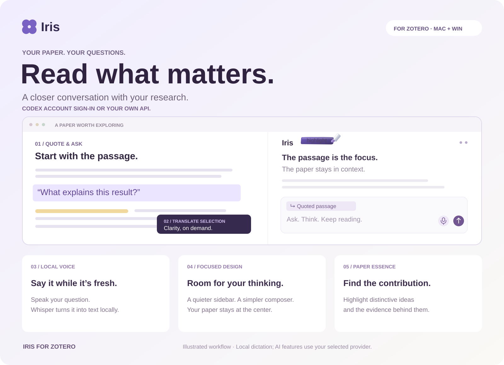

  <a href="#english">English</a> · <a href="#简体中文">简体中文</a>

# Iris for Zotero

### Your next good question starts inside the paper.

A focused AI reading companion for Zotero. **Ask about the passage in front of you, translate what slows you down, speak a question while it is fresh, and bring the paper’s distinctive contributions back into view.** All from your reading sidebar.

**[Download Iris →](https://github.com/zbhou2002/iris-zotero/releases/latest)** &nbsp; · &nbsp; [Get started](#start-reading-with-iris) &nbsp; · &nbsp; [简体中文 ↓](#简体中文)

**New in [3.4.16](https://github.com/zbhou2002/iris-zotero/releases/tag/v3.4.16):** a refined rainbow highlighter, consistent circular controls, and a calmer, evenly aligned composer.

### Your AI. Your way.

**Already use Codex? Connect through its supported account sign-in—no separate API key to enter.** Iris can bridge an existing Codex CLI OAuth login into your reading workflow. Prefer your own model service? Use an API endpoint, model and key when required. Choose **Account** or **API service** in Settings.

Account access follows your provider’s plan, available models and usage limits. It does not turn a subscription into unlimited API access.

### Five reasons to make room for Iris

| | A better way to stay with the paper |
| :-- | :-- |
| **01 · Quote a passage. Ask a sharper question.** | Select a passage in your PDF and attach it to your question. Iris focuses on that passage while keeping the paper as background context. Ask “Why does this follow?” without copying a paragraph into another app. |
| **02 · Translate the part that stops you.** | Select text and choose Translate. Get help with a difficult sentence or unfamiliar wording, right where you are reading. You choose when translation starts. |
| **03 · Speak the thought before it slips away.** | Dictate a question in Chinese, English or a mix of both. Local Whisper transcription turns your voice into text for the conversation. No separate transcription API key. |
| **04 · Less interface. More room to think.** | Quiet monochrome controls, compact passage references and a balanced composer keep attention on the paper. The input stays visually calm when you click it. Start fresh or return to an earlier conversation with the new-chat and history buttons. |
| **05 · Find the contribution—and its evidence.** | A short rainbow pen stroke brings Paper Essence within reach: select original passages about distinctive contributions and supporting evidence, directly in your PDF. During processing, the same control becomes cancel with a return arrow. Both labels stay in English in either interface language. |

### From “this sentence…” to your next insight

**Select a passage → ask or dictate a question → explore it with the paper in context.**

Translate when language gets in the way. Use Paper Essence to return to the source passages that deserve a closer look.

### Start reading with Iris

1. Download **`Iris-<version>.xpi`** from [Releases](https://github.com/zbhou2002/iris-zotero/releases/latest).
2. In Zotero: **Tools → Plugins → ⚙ → Install Add-on From File…** Select the XPI and restart Zotero.
3. Open a PDF, choose Iris in the sidebar, and connect your preferred model service in Settings.

**Windows + macOS · English + 简体中文 · Zotero 7–9 declared compatibility.** See the [setup guide](docs/GUIDE.md) for tested environments and optional voice setup.

A few things to know before your first conversation

- Chat, translation and Paper Essence use your selected model provider; use a supported account login or your own API credentials. Relevant text is sent to that provider.
- Voice input needs a one-time runtime/model download and microphone permission. Recognition then runs locally. Sending the transcript to chat sends its text to your selected provider. This is speech-to-text input, not spoken AI replies.
- AI highlights are a reading aid. Check the source when evaluating a claim. Scanned PDFs may need OCR.
- Tested environments include Windows and Apple Silicon macOS with Zotero 9.0.6. Intel Macs and other declared Zotero versions have not been fully validated; Linux has no automatic speech setup.

[Installation, updates & permissions](docs/GUIDE.md) · [Feedback & ideas](https://github.com/zbhou2002/iris-zotero/issues)

---

# Iris · 专注论文阅读

### 好问题，就在读到这一段的时候发生。

Iris 是陪你留在论文里的 AI 阅读助手。**选中文段就能追问，难懂的原文就地翻译，想到的问题直接说出来，独特贡献与关键证据回到原文中高亮。** 阅读、提问和思考，在 Zotero 侧栏里接着发生。

**[下载 Iris →](https://github.com/zbhou2002/iris-zotero/releases/latest)** &nbsp; · &nbsp; [安装与使用](docs/README.zh-CN.md) &nbsp; · &nbsp; [English ↑](#english)

**[3.4.16 新版](https://github.com/zbhou2002/iris-zotero/releases/tag/v3.4.16)：** 更精致的彩虹高亮笔、统一的圆形操作按钮，以及留白对称、点击时保持原色的输入区。

### 订阅也好，API 也好，用你自己的 AI。

**已经在用 Codex？通过支持的账号登录方式接入，不必再填一把 API Key。** Iris 可以桥接 Codex CLI 的已有 OAuth 登录，让你在论文旁使用账号可用的模型；也支持配置自己的 API 地址、模型和所需密钥。在设置中选择 **账号连接** 或 **API 服务** 即可。

账号方式仍遵循服务商的订阅权限、可用模型与用量限制，并不代表无限额度。

### 值得把它装进 Zotero 的五个理由

| | 让阅读更顺手，也更深入 |
| :-- | :-- |
| **01 · 引用这一段，把问题问到点上。** | 在 PDF 中选中文段，附上你的问题。Iris 聚焦这段内容，同时保留全文作为背景。问一句“这里为什么能得出这个结论？”，不用来回复制、切换窗口。 |
| **02 · 卡住你的那句话，就地读懂。** | 选中原文，点击翻译。处理难句和陌生表达时，把注意力留在正在读的位置。是否翻译，由你决定。 |
| **03 · 想到了，就说出来。** | 用中文、英文或中英混合表达问题，Whisper 在本机转写为对话文字。少打一点字，留住阅读时一闪而过的想法，无需额外的转写 API Key。 |
| **04 · 更清爽，也更专注。** | 单色操作按钮、小巧的引用标签和留白均衡的输入区，让空间回到论文和思考。点击输入框保持原色；随时新建对话，也能从历史记录接着聊。 |
| **05 · 抓住贡献，也找到依据。** | 像高亮笔划过纸面的一道彩虹，把独特贡献与支撑证据标回 PDF 原文。处理中，同一个按钮切换为带回退箭头的 cancel，随时取消。中英文界面都保留 highlight / cancel 英文标识；筛选标准也可自行调整。 |

### 从“这一句……”开始，顺着问题读下去

**选中文段 → 输入或说出问题 → 结合全文继续追问。**

遇到语言障碍时按需翻译；想回看论文的关键之处，就让文献精华帮你标出值得细读的原文。

### 三步开始

1. 在 [Releases](https://github.com/zbhou2002/iris-zotero/releases/latest) 下载 **`Iris-<版本>.xpi`**。
2. Zotero → **工具 → 插件 → ⚙ → 从文件安装**，选择安装包后重启 Zotero。
3. 打开 PDF，进入 Iris 侧栏，在设置中连接你使用的模型服务。

**Windows 与 macOS · 中英文界面 · 安装包声明支持 Zotero 7–9。** 实测环境及语音配置见[使用说明](docs/README.zh-CN.md)。

开始前，了解这几件事

- 对话、翻译和文献精华使用你选择的模型服务，可选支持的账号登录或自有 API 凭据，相关文本会发送给该服务商。
- 语音首次使用需要下载运行环境与模型，并允许麦克风。之后在本机识别；作为对话发送时，转写文字仍会发送给所选模型。当前是语音转文字输入，不是 AI 语音朗读回复。
- 精华高亮是阅读辅助，重要结论请回到原文核对；扫描版 PDF 可能需要先 OCR。
- 已测试 Windows 和 Apple Silicon Mac / Zotero 9.0.6。Intel Mac 和其他声明支持的 Zotero 版本尚未全面验证；Linux 暂无自动语音安装。

[安装、更新与权限说明](docs/README.zh-CN.md) · [反馈问题或建议](https://github.com/zbhou2002/iris-zotero/issues)

---

Product illustrations show conceptual workflows, not application screenshots. / 海报为功能概念示意，非应用截图。

Open source under [AGPL-3.0-or-later](LICENSE). Iris builds on [AIdea](https://github.com/Visterainer/aidea-zotero) and its upstream contributors; original notices are retained. [Acknowledgments & licenses](THIRD_PARTY_NOTICES.md) · [Source provenance](docs/PROVENANCE.md) · [Contributing](CONTRIBUTING.md). Independent community project; not affiliated with Zotero or model providers.
