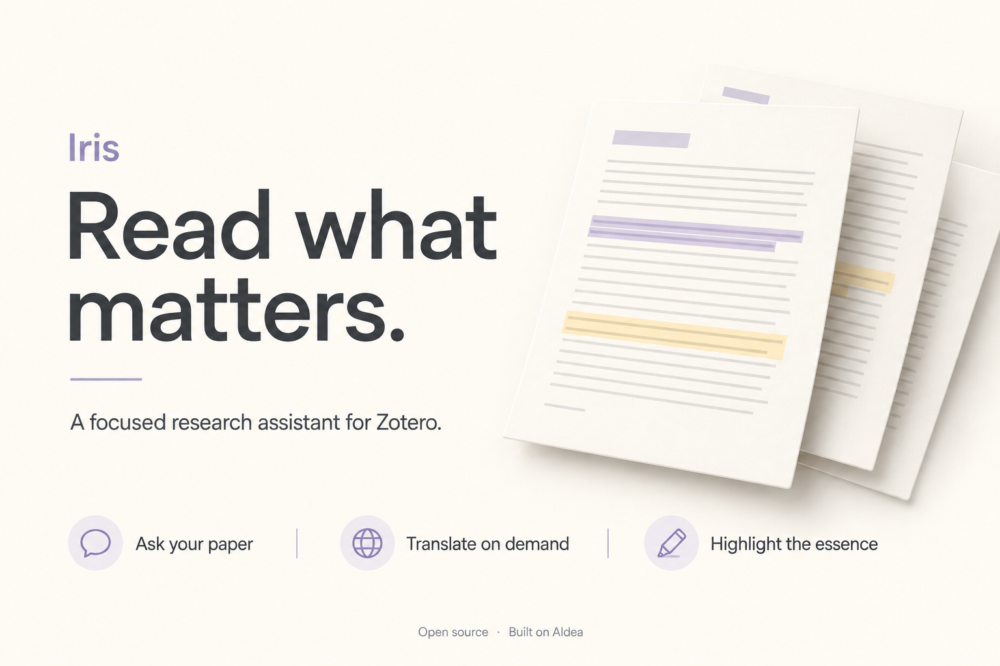

# Iris for Zotero

A quiet, focused research assistant for Zotero. Ask questions about your paper, translate a selection when you choose, and highlight passages that explain why a paper is worth reading.

[Download the latest release](https://github.com/zbhou2002/iris-zotero/releases/latest) · [中文说明](docs/README.zh-CN.md) · [Report an issue](https://github.com/zbhou2002/iris-zotero/issues)

## Read with less friction

- **Ask your paper.** The current PDF provides text context automatically. Keep conversations and drafts in a focused sidebar.
- **Ask about a passage.** With Iris open, select text in the PDF to attach a small “Quoted passage” chip above the composer. The paper title is available on hover; the passage itself is not displayed in the input area. Your question stays separate. On send, the quote is the focus, while the full paper remains background context. A new selection replaces the unsent quote; × removes it. Dismissing the PDF selection popup leaves the draft quote attached. Selecting alone never calls the model.
- **Translate on demand.** Select text, then click Translate. Selecting text alone does not start a model request.
- **Highlight the essence.** Ask the model to identify distinctive contributions and supporting evidence, then map selected passages to Zotero PDF highlights. Edit the selection prompt in Settings. There is no fixed sentence quota.
- **Dictate locally.** Multilingual speech transcription runs locally after the optional runtime and model download. Stop to insert text, send to transcribe and send, or cancel to discard the current recording. No transcription API key is required.
- **Choose your language.** Follow your system language, or choose English / 简体中文 in Settings. Changes apply immediately, without restarting or clearing your drafts and conversations.

The hero above is an editorial illustration, not an application screenshot. Iris is an independent community fork of [AIdea](https://github.com/Visterainer/aidea-zotero), not an official Zotero, Apple, or OpenAI product.

## Install

1. Download `Iris-<version>.xpi` from [Releases](https://github.com/zbhou2002/iris-zotero/releases/latest).
2. In Zotero, open **Tools → Plugins** (called **Add-ons** in some versions).
3. Choose the gear menu → **Install Add-on From File…**, select the XPI, and restart Zotero.
4. Open a PDF and select Iris in the reader sidebar. Use the gear in Iris to connect your model service.

**Upgrading from AIdea or an earlier local Iris build:** install the XPI over the existing addon; do not uninstall first. Iris keeps the existing `aidea@visterainer` addon ID and preference namespace to preserve the migration path. Iris and AIdea therefore cannot be installed side by side. Back up your Zotero profile before migrating.

After this first formal installation, Zotero can retrieve future Iris releases through its addon updater. Copying an XPI directly into the profile folder may not update Zotero's registered addon metadata; use the plugin manager for the initial migration. Automatic updates also depend on Zotero's update preferences and GitHub network access.

## Compatibility and setup

The package declares Zotero **7–9** compatibility. Runtime checks have been performed on **Windows with Zotero 9.0.6**; other Zotero versions and macOS have not been fully validated. The XPI is platform-neutral. Optional local dictation includes Windows and macOS setup scripts; Linux automatic speech setup is not currently provided. Microphone access and a successful local runtime/model installation are still required.

Chat, translation, and AI highlights use the model provider you select. They are **not offline** just because dictation is local, and a provider account or API credentials may be required. Model accuracy, provider availability, and response time vary. Highlights are reading aids, not an objective ranking or a substitute for checking the paper. Scanned PDFs without usable text may need OCR first.

Dictation's first setup downloads Python dependencies and a Whisper model and can take time and disk space. Once setup is complete, the transcription helper blocks network access during recognition. Sending the resulting text as a chat message still sends that text to the selected model provider.

## Build from source

Requires Node.js 22+ and Python 3.12+. The Iris packaging path uses only their standard libraries; no npm install is needed.

```sh
npm run check
python scripts/package.py
```

The installer, update manifest, and checksum are written to `dist/`. The patch-based source layout and original upstream source are documented in [PROVENANCE](docs/PROVENANCE.md). See [CONTRIBUTING](CONTRIBUTING.md) for the release procedure.

## Privacy and license

Only source code, distributable assets, tests, and documentation belong in this repository. Zotero libraries, PDFs, conversations, recordings, credentials, and local runtime caches are not included. Review your model provider's data policy before sending paper text. Do not attach personal profiles or unredacted logs to public issues.

Iris retains the upstream **AGPL-3.0-or-later** license; see [LICENSE](LICENSE), [third-party notices](THIRD_PARTY_NOTICES.md), and [provenance](docs/PROVENANCE.md). All original notices are retained. System fonts are used; proprietary OpenAI font files are not redistributed.
