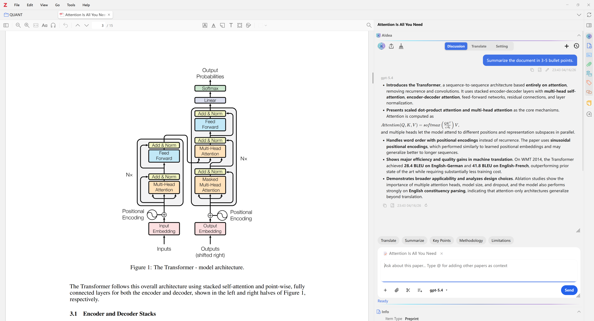
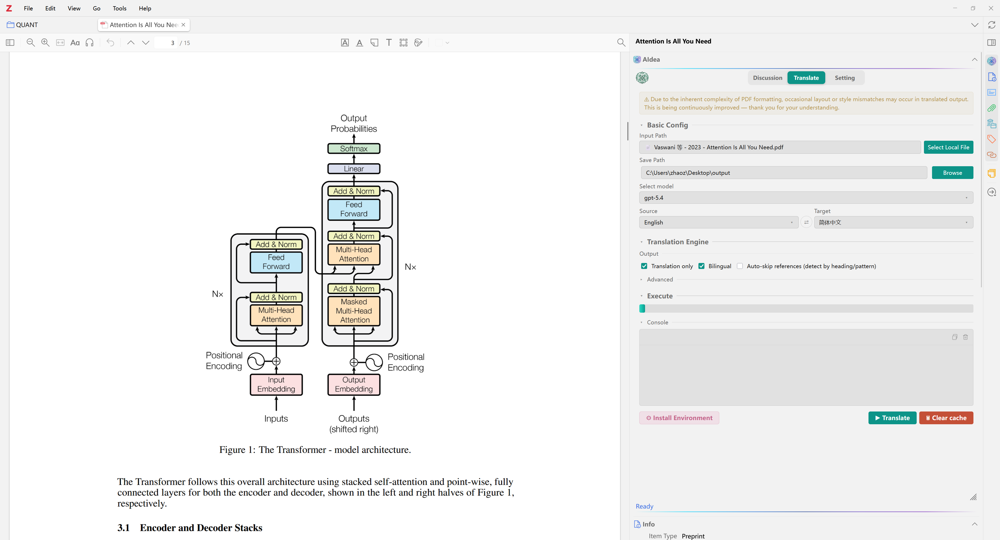
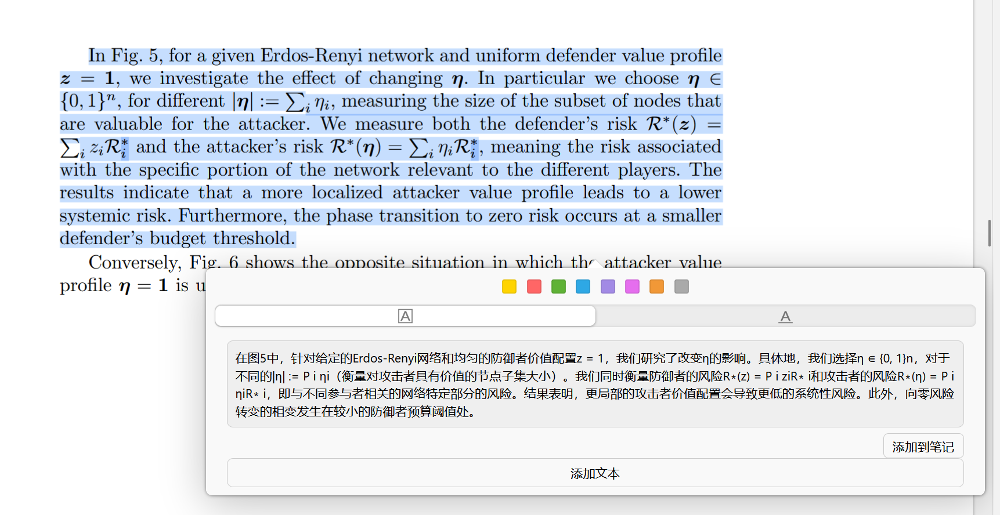
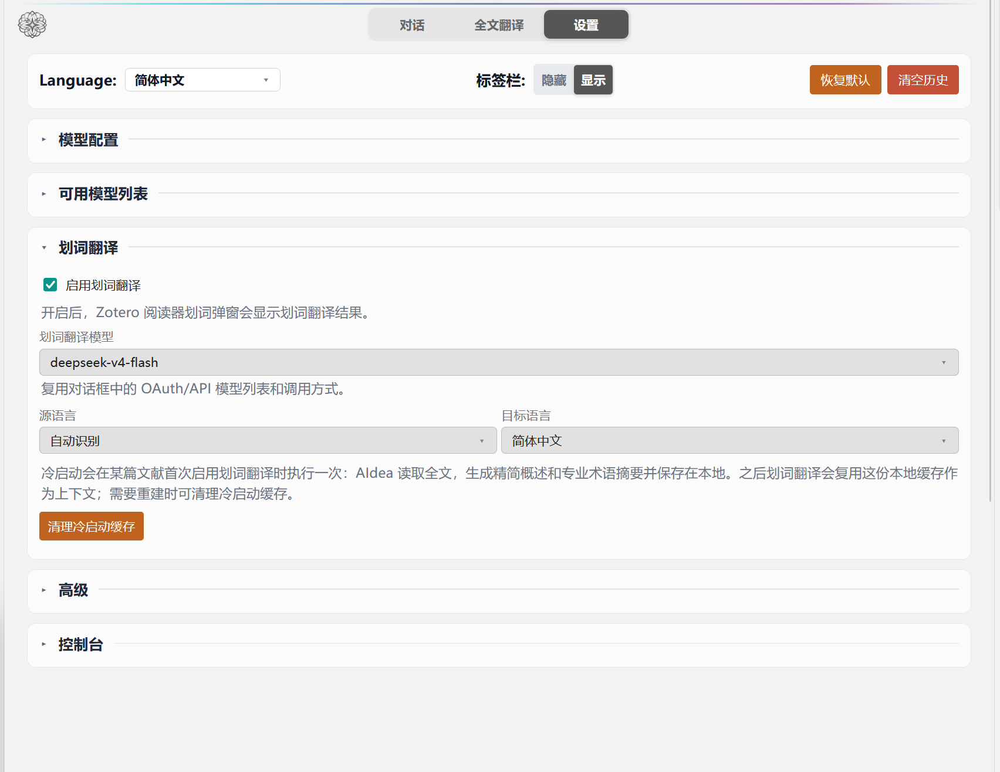
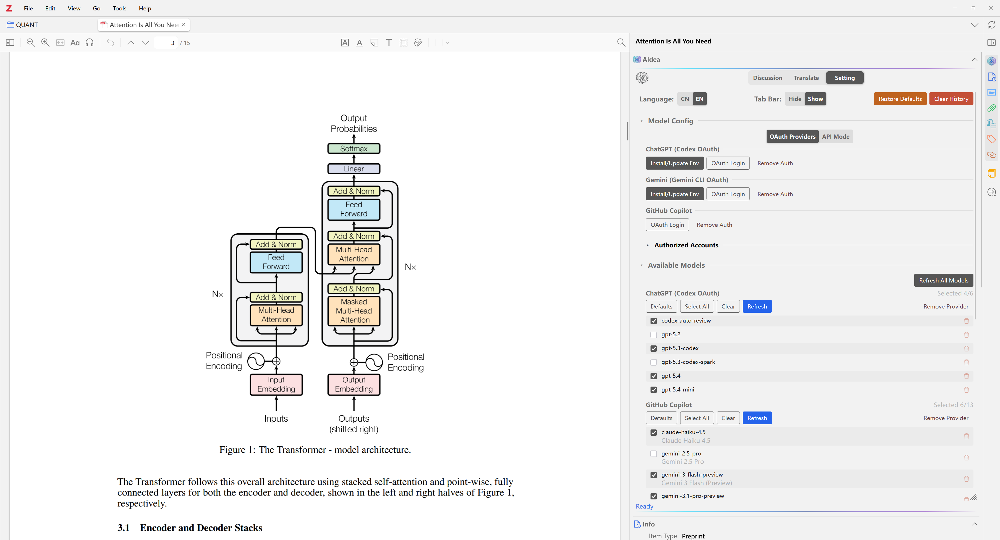

<p align="center">
  
</p>

# AIdea

<p align="center">
  <a href="../../README.md">English</a>
  ·
  <a href="./README.zh-CN.md">简体中文</a>
  ·
  <a href="./README.zh-TW.md">繁體中文</a>
  ·
  <a href="./README.ja.md">日本語</a>
  ·
  <a href="./README.ko.md">한국어</a>
  ·
  <a href="./README.fr.md">Français</a>
</p>

<p align="center">
  <strong>🌐 Website:</strong> <a href="https://visterainer.github.io/aidea-zotero/ja/">https://visterainer.github.io/aidea-zotero/ja/</a>
</p>

AIdea は、Zotero 向けの無料かつオープンソースの AI 研究支援プラグインです。🔐 OpenAI（ChatGPT）、Google Gemini、GitHub Copilot での OAuth ログインに対応しています。⚙️ さらに、OpenAI 互換 API や、Ollama、LM Studio、vLLM などを通じたローカル／セルフホストモデルにも対応しています。複数プロバイダ対応の対話、文書コンテキスト解析、ノート書き戻し、記憶機能、全文翻訳を、Zotero のライブラリ画面、PDF リーダー、EPUB リーダーに統合します。

<p align="center">
  
  
  
</p>

<p align="center">
  
  
  
  
</p>

## 概要

AIdea は、論文や電子書籍の読解、追質問、抜粋、ノート整理、選択範囲の翻訳、全文翻訳を Zotero の中で完結させたい研究者向けに設計されています。ライブラリ画面、PDF リーダー、EPUB リーダーに継続利用しやすい AI ワークスペースを追加します。

## 主な機能

- **サイドパネル AI チャット** を Zotero ライブラリ画面、PDF リーダー、EPUB リーダーで利用可能
- **文書コンテキスト解析** により、PDF の選択箇所、EPUB 2/3 の出版者構造、スクリーンショット、図表、添付ファイルを参照可能
- **クイックアクション** による要約、解説、翻訳などの定型操作
- **複数の接続方式** として OAuth ログインと OpenAI 互換 API モードをサポート
- **全文翻訳** を Zotero 内で実行し、PDF として書き出し可能
- **選択範囲の翻訳** を PDF または EPUB リーダーで実行し、文書形式を自動判別して、範囲を制限した文書コンテキストを使いながら Zotero ノートへ追加可能
- **ローカル履歴と記憶** により、ライブラリ単位の分離、ノート書き戻し、継続対話を実現
- **豊富なレンダリング** として Markdown、コードブロック、表、LaTeX、ストリーミング表示をサポート

## スクリーンショット

### サイドパネルチャット

<p align="center">
  
</p>

### 全文翻訳

<p align="center">
  
</p>

### 選択範囲の翻訳

<p align="center">
  
</p>

<p align="center">
  
</p>

### プロバイダとモデル設定

<p align="center">
  
</p>

## 対応する接続方式

| 方式                      | 認証                                 | 補足                                                     |
| ------------------------- | ------------------------------------ | -------------------------------------------------------- |
| OpenAI（ChatGPT）         | Codex CLI 経由の OAuth               | 必要な場合はプラグインが Node.js 実行環境を自動導入      |
| Google Gemini             | プラグイン内 OAuth（PKCE）           | 必要な場合はプラグインが Node.js 実行環境を自動導入      |
| GitHub Copilot            | プラグイン内 OAuth（Device Code）    | Node.js の追加導入は不要                                 |
| OpenAI 互換エンドポイント | API Base URL、モデル、任意の API Key | ローカル、自前運用、またはサードパーティ互換サービス向け |

## インストール

### 動作条件

- Zotero 7 以降
- Node.js は選択したプロバイダで必要な場合のみ使用し、対応フローでは AIdea が自動導入可能

### プラグインの導入

1. [Releases](https://github.com/Visterainer/aidea-zotero/releases) から最新の `.xpi` パッケージを取得します。
2. Zotero で `Tools` -> `Add-ons` を開きます。
3. 歯車メニューから `Install Add-on From File...` を選びます。
4. ダウンロードした `.xpi` ファイルを指定します。
5. Zotero を再起動します。

### 更新

新しい `.xpi` を上書きインストールするだけで更新できます。AIdea はローカル設定、チャット履歴、記憶データを保持します。

## クイックスタート

1. `Tools` -> `Add-ons` -> `AIdea` -> `Settings` を開きます。
2. OAuth ログインまたは API モードを選択します。
3. 利用可能なモデルを更新し、使用するモデルを選びます。
4. Zotero のアイテム、PDF、または EPUB を開き、AIdea サイドパネルから利用を開始します。

全文翻訳を行う場合は翻訳タブに切り替え、モデルと出力先を設定して Zotero 内で実行します。

選択範囲の翻訳を使う場合は、設定で機能を有効にしてモデルを選び、PDF または EPUB リーダーでテキストを選択します。文書形式は AIdea が自動判別します。PDF の初回利用時には要約と重要用語を含むローカルのコールドスタートキャッシュを作成します。EPUB では選択箇所を基準に範囲を制限した書籍コンテキストを直接利用し、別のウォームアップ要求は行いません。

## 言語対応

- **プラグイン UI：** English、简体中文、繁體中文、日本語、한국어、Français、Deutsch、Español、Русский、Português、العربية、हिन्दी
- **ドキュメントとウェブサイト：** English、简体中文、繁體中文、日本語、한국어、Français

## プライバシーとデータ処理

- OAuth トークンはローカル環境に保存されます。
- API 通信は、選択したプロバイダまたは設定したエンドポイントへ直接送信されます。
- チャット履歴と記憶データは Zotero のローカル SQLite データベースに保存されます。
- このプロジェクトは中継サービスを提供せず、利用状況のテレメトリも収集しません。

## 開発

```bash
npm install
npm start
npm run build
npm run test:unit
```

## ライセンスと謝辞

AIdea は [AGPL-3.0-or-later](../../LICENSE) のもとで公開されています。

本プロジェクトは [llm-for-zotero](https://github.com/yilewang/llm-for-zotero) を基に発展したものです。サードパーティに関する記載は [THIRD_PARTY_NOTICES.md](../../THIRD_PARTY_NOTICES.md) を参照してください。

## ⭐ Star History

<a href="https://star-history.com/#Visterainer/aidea-zotero&Date">
 <picture>
   <source media="(prefers-color-scheme: dark)" srcset="https://api.star-history.com/svg?repos=Visterainer/aidea-zotero&type=Date&theme=dark" />
   <source media="(prefers-color-scheme: light)" srcset="https://api.star-history.com/svg?repos=Visterainer/aidea-zotero&type=Date" />
   
 </picture>
</a>
