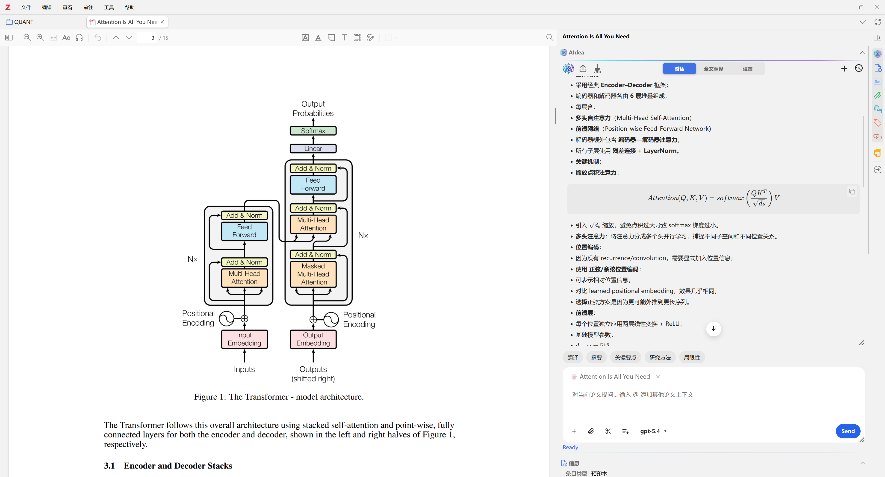
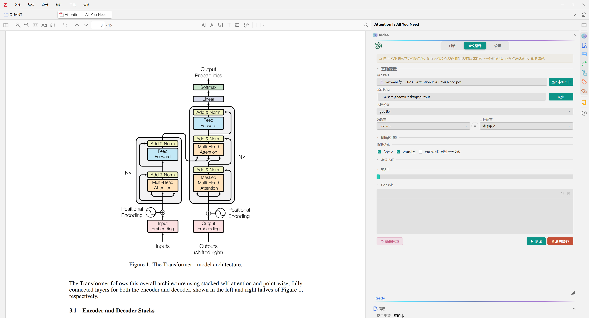
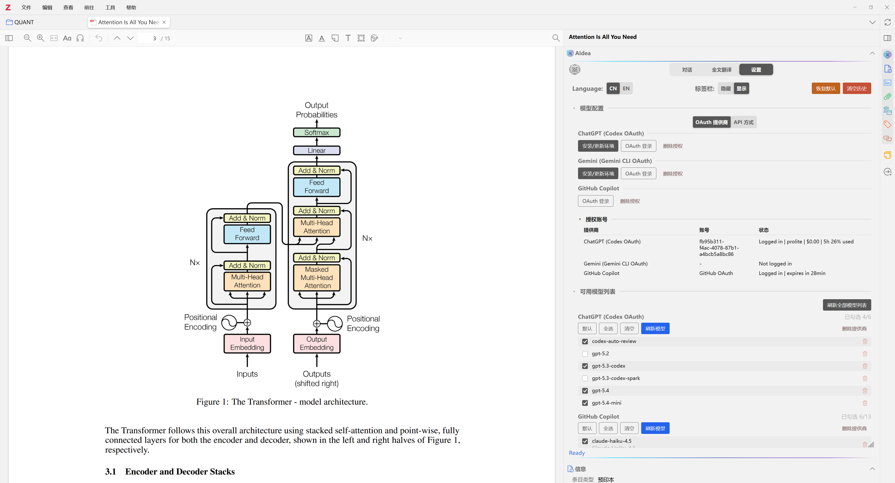

<p align="center">
  
</p>

# AIdea

<p align="center">
  <a href="../../README.md">English</a>
  ·
  <a href="./README.zh-CN.md">简体中文</a>
  ·
  <a href="./README.zh-TW.md">繁體中文</a>
  ·
  <a href="./README.ja.md">日本語</a>
  ·
  <a href="./README.ko.md">한국어</a>
  ·
  <a href="./README.fr.md">Français</a>
</p>

<p align="center">
  <strong>🌐 Website:</strong> <a href="https://visterainer.github.io/aidea-zotero/zh-tw/">https://visterainer.github.io/aidea-zotero/zh-tw/</a>
</p>

AIdea 是一款面向 Zotero 的免費開源 AI 研究助手外掛。🔐 支援 OpenAI（ChatGPT）、Google Gemini、GitHub Copilot 的 OAuth 登入。⚙️ 也支援 OpenAI 相容 API，以及透過 Ollama、LM Studio、vLLM 等環境接入本地或自託管模型。它可將多提供商對話、論文上下文分析、筆記匯出、記憶能力與全文翻譯整合到 Zotero 的資料庫檢視、PDF 閱讀器與 EPUB 閱讀器中。

<p align="center">
  
  
  
</p>

<p align="center">
  
  
  
  
</p>

## 專案概覽

AIdea 面向需要在 Zotero 內完成論文與電子書閱讀、追問、摘錄、筆記整理、劃詞翻譯與全文翻譯的研究型工作流程。它為 Zotero 的資料庫檢視、PDF 閱讀器與 EPUB 閱讀器提供一致且可持續的 AI 工作區，減少在多個外部工具之間切換的成本。

## 核心能力

- **側邊欄 AI 對話**，可在 Zotero 資料庫檢視、PDF 閱讀器與 EPUB 閱讀器中使用
- **文件感知上下文**，支援 PDF 選段、EPUB 2/3 出版目錄結構、截圖、圖表與附件參與分析
- **快捷操作按鈕**，可用於總結、解釋、翻譯等常見任務
- **多種連線方式**，支援 OAuth 登入與 OpenAI 相容 API 模式
- **全文翻譯**，可在側邊欄內執行並匯出 PDF
- **劃詞翻譯**，可在 PDF 或 EPUB 閱讀器選取文字後直接翻譯，自動識別目前格式、使用有界文件上下文並加入 Zotero 筆記
- **本地歷史與記憶**，支援按文庫隔離、筆記回寫與持續對話
- **豐富渲染能力**，支援 Markdown、程式碼區塊、表格、LaTeX 與串流輸出

## 截圖

### 側邊欄對話

<p align="center">
  
</p>

### 全文翻譯

<p align="center">
  
</p>

### 劃詞翻譯

<p align="center">
  
</p>

<p align="center">
  
</p>

### 提供商與模型設定

<p align="center">
  
</p>

## 支援的連線方式

| 方式              | 驗證方式                         | 說明                                    |
| ----------------- | -------------------------------- | --------------------------------------- |
| OpenAI（ChatGPT） | 透過 Codex CLI 完成 OAuth        | 外掛可在需要時自動安裝 Node.js 執行環境 |
| Google Gemini     | 外掛內 OAuth（PKCE）             | 外掛可在需要時自動安裝 Node.js 執行環境 |
| GitHub Copilot    | 外掛內 OAuth（Device Code）      | 無需額外的 Node.js 啟動步驟             |
| OpenAI 相容端點   | API Base URL、模型與可選 API Key | 適用於本地、自託管或第三方相容服務      |

## 安裝

### 環境需求

- Zotero 7 或更新版本
- 僅在所選服務商需要時使用 Node.js；對支援的流程，AIdea 可自動安裝

### 安裝外掛

1. 從 [Releases](https://github.com/Visterainer/aidea-zotero/releases) 下載最新的 `.xpi` 安裝包。
2. 在 Zotero 中開啟 `工具` -> `附加元件`。
3. 點擊齒輪選單，選擇 `從檔案安裝附加元件...`。
4. 選取下載好的 `.xpi` 檔案。
5. 重新啟動 Zotero。

### 升級

直接安裝新的 `.xpi` 即可覆蓋舊版本。AIdea 會保留本地設定、聊天記錄與記憶資料。

## 快速開始

1. 開啟 `工具` -> `附加元件` -> `AIdea` -> `設定`。
2. 選擇 OAuth 登入或 API 模式。
3. 重新整理可用模型並選擇要使用的模型。
4. 開啟 Zotero 條目、PDF 或 EPUB，從 AIdea 側邊欄開始使用。

如需執行全文翻譯，可切換到翻譯分頁，設定模型與輸出路徑後直接在 Zotero 內執行任務。

如需使用劃詞翻譯，可在設定中啟用此功能並選擇模型，之後在 PDF 或 EPUB 閱讀器選取文字即可，無需手動切換格式。PDF 首次使用時會建立包含精簡概述與專業詞摘要的本地冷啟動快取；EPUB 則直接使用以選取文字為錨點的有界圖書上下文，不會額外執行暖機請求。

## 語言支援

- **外掛介面：** English、简体中文、繁體中文、日本語、한국어、Français、Deutsch、Español、Русский、Português、العربية、हिन्दी
- **文件與專案網站：** English、简体中文、繁體中文、日本語、한국어、Français

## 隱私與資料處理

- OAuth 權杖保存在本地裝置上。
- API 請求直接傳送至所選服務商或你設定的端點。
- 聊天記錄與記憶資訊保存在 Zotero 本地 SQLite 資料庫中。
- 專案本身不提供中繼服務，也不收集外掛使用遙測。

## 開發

```bash
npm install
npm start
npm run build
npm run test:unit
```

## 授權與致謝

AIdea 採用 [AGPL-3.0-or-later](../../LICENSE) 授權發佈。

本專案基於 [llm-for-zotero](https://github.com/yilewang/llm-for-zotero) 演進而來。第三方聲明請參閱 [THIRD_PARTY_NOTICES.md](../../THIRD_PARTY_NOTICES.md)。

## ⭐ Star History

<a href="https://star-history.com/#Visterainer/aidea-zotero&Date">
 <picture>
   <source media="(prefers-color-scheme: dark)" srcset="https://api.star-history.com/svg?repos=Visterainer/aidea-zotero&type=Date&theme=dark" />
   <source media="(prefers-color-scheme: light)" srcset="https://api.star-history.com/svg?repos=Visterainer/aidea-zotero&type=Date" />
   
 </picture>
</a>
